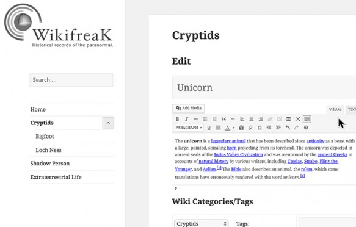
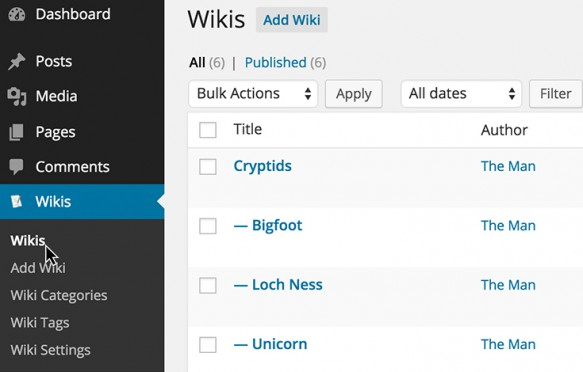
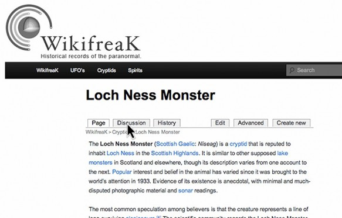
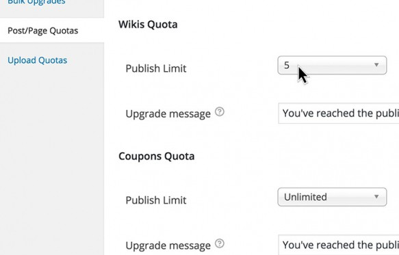

# PS-Wiki

**Zusammenarbeiten, diskutieren, Crowdsourcing betreiben und bessere Inhalte erstellen mit PS-Wiki für ClassicPress, Multisite und BuddyPress.**

## Füge mit PS-Wiki Front-End-Zusammenarbeit und -Bearbeitung von Inhalten zu ClassicPress hinzu. Crowdsourcen Sie alles von Informationsblättern und Bedienungsanleitungen bis hin zu kreativen Schreibprojekten.

Mit PS-Wiki kannst Du ganz einfach alles erstellen, von einer Sammlung von von Mitgliedern verwalteten Nutzungsdokumenten bis hin zu einer Fandom-Webseite für Deine Lieblingsfernsehsendung, auf der Du Informationen über Charaktere, Orte, Regisseure und Episoden sammeln und diskutieren kannst. Gibt es einen besseren Weg, Deine Benutzer einzubeziehen, als ihnen einen sinnvollen Beitrag zu ermöglichen?

### Aktivieren und loslegen

**PS-Wiki funktioniert sofort mit ClassicPress, Multisite und BuddyPress und passt sich an fast jedes Thema an.**

**7 integrierte Widgets** Verwende integrierte Widgets, um Wiki-Seiten, beliebte Wikis, neue Wikis, Wiki-Suche, Wiki-Kategorien, Wiki-Tags oder eine Wiki-Tag-Cloud in jedem Widget-Bereich anzuzeigen.

**Kontrolliere den Benutzerzugriff** Beschränke die Bearbeitungsmöglichkeiten standardmäßig nach Benutzerrolle oder sogar nach Mitgliedschaftsstufe, wenn sie mit PS Mitgliedschaften gekoppelt sind.

**Benutzerdefinierte Titel** Gib Deinen Wikis und Sub-Wikis einen benutzerdefinierten Namen, z. B. „Community Fact Sheet“, „Usage Docs“ oder „Fan Fact Curation“. Mache sie zu Deinen.

**Anzeigereihenfolge konfigurieren** Zeige Wiki-Archive in aufsteigender oder absteigender Reihenfolge nach Titel, erstellter Reihenfolge, Titel oder zufällig an – je nachdem, was Deinen Anforderungen am besten entspricht.

Die vollständige Front-End-Schnittstelle erleichtert jedem Benutzer die Zusammenarbeit.

### Front-End-Steuerung… wie ein Wiki sein sollte

PS-Wiki verfügt über eine einfache Front-End-Schnittstelle, die die Verwendung unglaublich einfach macht. Erstelle, bearbeite, überprüfe oder nimm an der Konversation teil – alles über das Frontend Deiner Webseite.

Verwalte und verfolge Änderungen wie ein ClassicPress-SuperHero über die Registerkarte „Verlauf“ mit Revisionsvergleichen und Wiederherstellung mit einem Klick – für alle Fälle.

### Bessere Suchergebnisse

Durchsuche schnell Hunderte von Beiträgen, Updates und Diskussionen. PS-Wiki verwendet Wiki-spezifische Tags und Kategorien, um das Auffinden von Inhalten zu erleichtern. Der Dashboard-Manager und benutzerdefinierte Beitragstypen ermöglichen Administratoren einen schnellen Zugriff über das Backend.

Wiki-spezifische Tags und Kategorien ermöglichen eine leistungsfähigere Suche.

Diskussionsforen bieten klare Kommunikationswege.

### Diskussionsforen

Themenspezifische Diskussionsforen bieten Benutzern mehr Möglichkeiten zur Interaktion. Es ist wie ein Cloud-Dokument zur Post-Erstellung mit Kommentaren, gemeinsamem Schreiben und Versionierung. Mache Klarstellungen, stelle Fragen, arbeite gemeinsam an der Recherche oder teile eine neue Perspektive.

### PS Bloghosting und Premium-Plugin-Integration

Mit der integrierten [PS Bloghosting](https://cp-psource.github.io/ps-bloghosting/)-Integration kannst Du die Wiki-Erstellung einschränken und unbegrenzt viele Wikis als kostenpflichtiges Upgrade anbieten. Steigere die Produktivität und ändere die Art und Weise, wie Benutzer mit Inhalten auf Deiner Webseite oder Deinem Netzwerk interagieren.

PS-Wiki lässt sich nahtlos in PS Bloghosting integrieren.

### Deiner Fantasie sind keine Grenzen gesetzt

PS-Wiki ist ein einfaches Plugin, das die volle Leistungsfähigkeit der ClassicPress-Taxonomien und Beziehungen zwischen Beitragstypen freischaltet. Von Fandom-Seiten über Spiele-Wikis bis hin zu Forschungskooperationen – oder einfach nur eine umfassende Liste aller Pflanzenarten in Deiner Nähe – mit PS-Wiki ist alles möglich.
